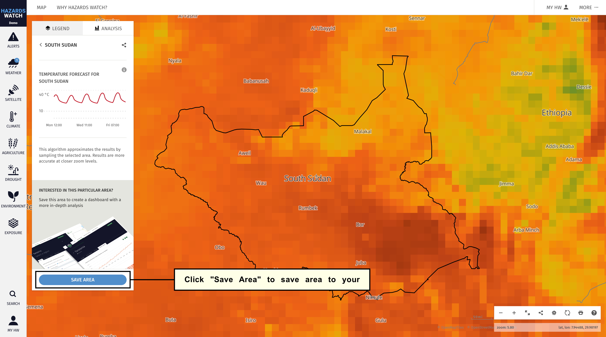

# Save an area of interest

On HW, you can save any areas of interest on the map. Saving an area helps keep your areas of interest organized without needing to relocate, reupload or redraw the shape every time you need to access it.

1. You can save areas at the country or regional level in addition to any custom shapes you’ve created or uploaded on the map. Please note that you will need to create a MyHW account in order to save and subscribe to any areas on the map.

    - To save and subscribe to an area at the country level, start by clicking the country of interest on the map. You can also use the search tool on the bottom left to find the country that you’d like to analyze. Learn more about searching for an area here.
    
    

    - The process is the same for subnational regions. Simply zoom in and click on the boundary of interest or use the search tool to find the area.

    

    - To save a custom area, either draw or upload a shape using the analysis tool. Learn more about analyzing a custom area on the map here.

    

2. Regardless of what type of area you select, a pop-up window will appear with the option to analyze the area. Click “Analyze” and the analysis will automatically run and produce data charts in the legend/analysis panel. At the bottom of the legend/analysis panel, an options to “Save area" will appear. Click “Save in MyHW” to save the area.

3. If you are not logged in or have not created a MyHW account, you will be prompted to log in or create an account. You can sign up with any valid email address by clicking “Sign up” at the bottom of the pop-up window. 
After signing up, you will be sent an email to finalize your account setup.

If you are creating an account, you will need to fill out your profile information before saving an area to your MyHW account. Your profile information is used to make HW more useful to you and is never shared without your consent. You will need to fill out information such as your name, email address, sector, role, organization name, location, interests and other relevant fields. Once complete, click “Next” and you will be able to save an area to your MyHW account

4. Once logged in and after clicking “Save area,” you will be able to save your area. A “Save your area of interest” form will appear on the map, including several customizable options to categorize and tailor your area: name the area, assign tags to help you organize and manage your saved areas.

## Manage Saved Areas

Once an area of interest has been created and saved on the map, there are several options for managing, editing and sharing these areas. Below you will find information on how to manage saved areas from the map and from your MyHW account.

### Manage saved areas from the map

1. To manage a saved area of interest directly from the map, click the “MyHW” category on the menu. To access your saved areas of interest, you must be logged in to your MyHW account. From here, any areas of interest saved to your MyHW account will appear.

2. From this view, you can filter areas by any assigned tags by clicking “Filter by tags.” A drop-down menu of any tags you created will appear, and you can click on one or multiple tags to display all areas tagged with what you select.

3. You can also edit your areas of interest from this view. Click the area you wish to edit and a pencil icon will appear to the right of the area’s name. Click the "dots" icon to activate a menu and select “Edit area of interest” option. On the form, you will be able to rename areas and assign tags.

### Manage saved areas from MyHW

1. The second way to manage a saved area of interest is from MyHW. To access MyHW, navigate to the homepage or, from the map, click the Hazards Watch” logo on the top left of the webpage. Once the HW homepage loads, click “MyHW” at the top right of the webpage.

2. You will then be directed to the MyHW webpage, where you can access more detailed information on your areas of interest.

3. From this page, you have a few more options for managing your saved areas of interest. You can organize the areas by assigned tags or by creation date, or search for key terms to quickly find an area. To the right of each area of interest, you will notice “View on Map,” “Edit” and “Share” icons. “View on Map” will take you to the area on the map; “Edit” will take you to the “Edit an area of interest” form where you can make changes to the area; and “Share” will generate a unique link that captures your area to share with others.

In short, HW makes managing your saved areas easy by offering multiple options for editing and organizing them.