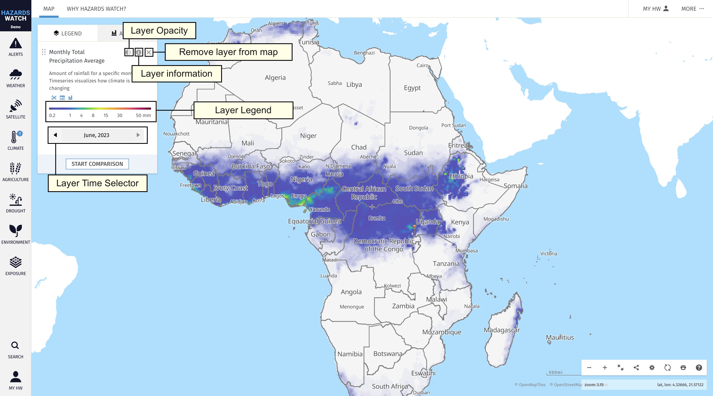
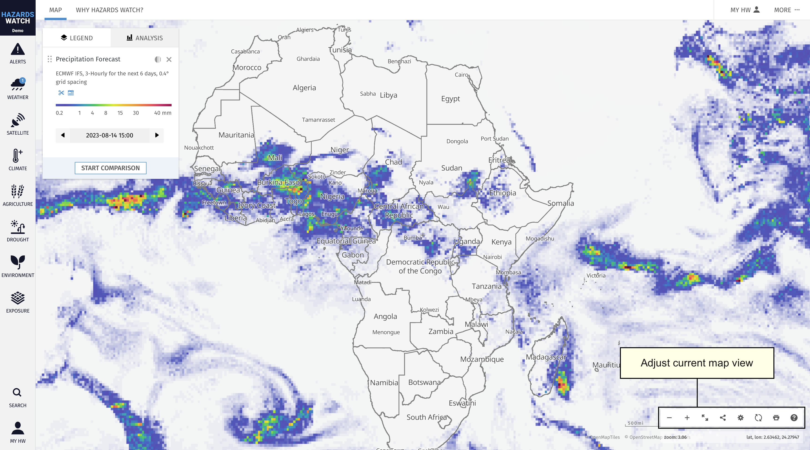
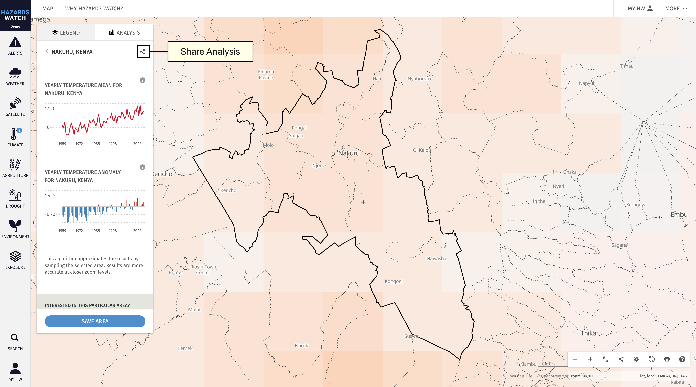
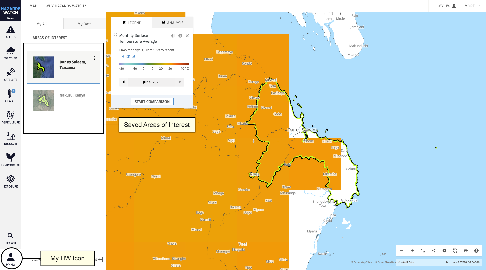
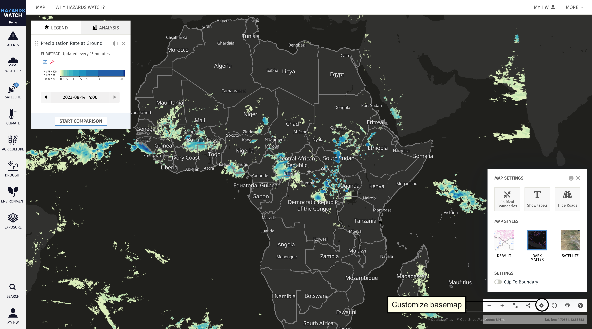

# Using the map interface

The map allows you to visualize and analyze spatial data layers. Below you’ll find key functionalities to help you explore, create and share custom map visualizations using the data on the map.

- **Access other parts of the site**. Use the main menu at the top of the screen to access other parts of the website. This includes the about page, and the Help pages. This menu will always be visible no matter what part of the website you are currently on.

- **Manage your My HW account**. Edit your user profile and view your saved areas of interest. Learn more about managing your My HW account here.

- **Browse and select data.** Available data layers are organized by category. You can combine data in the "Alerts" category with contextual layers in other categories – like "Weather" and “Exposure" – to identify potential impacts of extreme alerts on infrastructure for example.

- **Adjust data settings and learn more about the data.** Once you activate a data layer, it will appear in the legend along with any settings options that are available for that data layer. For example, you can change the current active date for data layers, change the opacity, learn more about a data layer’s metadata, and remove a data layer from the legend. You can also change the order that the data layers appear in by dragging an activated data layer on the legend above or below other activated data layers. Learn more about adjusting data settings here.

- **Adjust and share your map view.** Zoom in and out or expand the map to hide panels from your view by using the first three icons on the bottom right of the map. From here, you can click the share icon to generate a unique link that captures your exact map view to share with others. You can also generate HTML to embed your map view within an external website. Learn more about adjusting map settings here.

- **Analyze data on the map and save an area**. There are two ways to analyze data on the map, available by clicking the “Analysis” tab: Analyze a country or subnational jurisdiction and analyze a custom area. After analyzing an area, you will have the option to save it to your MyHW account. After saving the area, you can later access the area from your account. Learn more about analyzing data on the map here, and about saving an area here.

- **Access your saved areas.** Access and visualize the areas saved to your MyHW account. When you save additional locations to your account, they will also appear in the MyHW category. Learn more about managing saved areas here.

- **Customize the basemap.** Change the basemap to view the data with a different map background. The boundaries of the basemap are customizable, and you can select whether labels and roads are shown. Learn more about selecting and customizing the basemap here.

- **Search for data or locations.** Search for a data layer, location, coordinates, decimal degrees or UTM coordinates. Learn more about how to search for an area here.