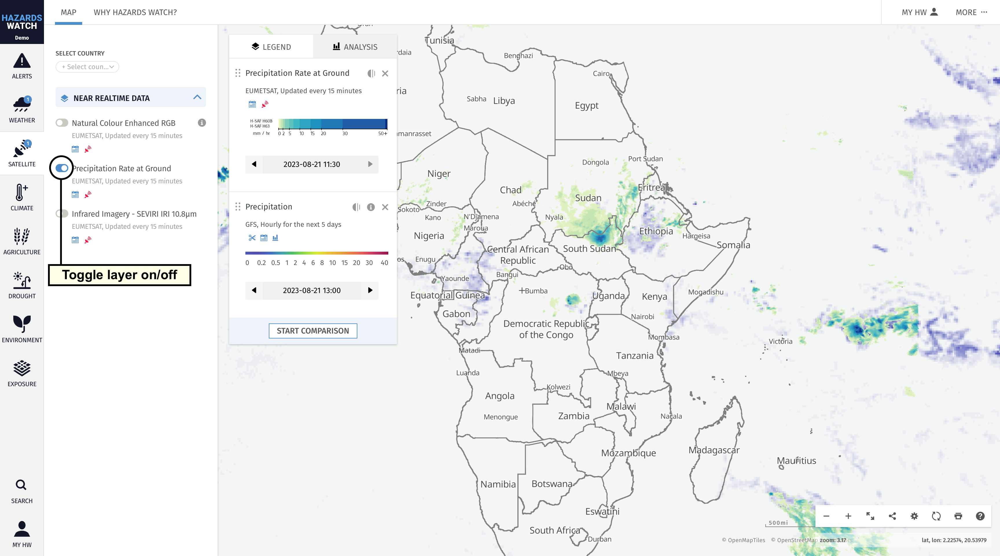
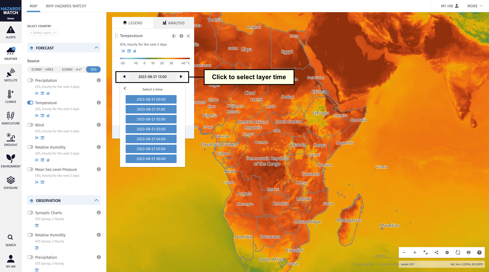

# Adjust map and data settings

Hazards Watch Map offers several ways to customize the map view as well as the data you are viewing. Below are steps on how to adjust map and data layer settings.

## Data layer settings
- **Learn more about the data you are viewing.** Click the information “i” icon to the right of the data layer find the source, research methodology, time period available and other important details about the data layer. This will activate a pop-up window with more information and links to download

- **Add and remove data layers.** You can customize which data layers you want to view on the map. To add a data layer to the map, click on a category on the left side of the map and activate the data layer you want to view. Remove data layers in the same way, or by clicking the remove layer “x” icon next to the data layer on the legend. A small circle with a number will indicate how many data layers you have activated in each category.

- **Adjust opacity for a data layer.** When overlaying a data layer over satellite imagery or a basemap or another layer, it can be hard to see what’s beneath the data layer displayed. To make a data layer more transparent, click on the opacity icon next to the data layer on the legend, then click and drag the opacity to your preferred percentage.

- **Adjust the date of data being viewed.** To view different dates for data layers that display a time selector, click the time selector and a calendar or time picker will be shown. Click on the date/time or interest to apply on the layer

- **Adjust layer variables.** Some data layers, such as global temperature forecasts, offer the ability to adjust variables like the atmospheric height or pressure. You can click or select the variable to change the data shown on the map

- **Reorder data layers.** When you add a data layer to the map, it will appear at top of the legend in the order you add them. The topmost data layer will appear above other data layers on the map. To reorder data layers, select the drag-and-drop icon to the left of any data layer’s name, and drag and drop it above or below other data layers as you prefer.

## Map view settings

- **Zoom in and out on the map.** There are several options for zooming in or out on the map. The first is to center the crosshairs in the center of the map over your area of interest then click on the zoom out “-” icon or zoom in “+” icon at the bottom right of the map. The second is to hover your mouse over the area you want to see, then scroll using the scroll wheel on your mouse. To zoom in and out from a mobile device, touch two fingers on the map and draw them apart.

- **Expand the map view.** If you would like to remove the map settings tools from your view of the map, click the show map only icon on the bottom right of the map. Click the icon again to make these options appear as they were before.

- **Change the basemap you are viewing on the map.** When you first come to the map, the basemap will be set to “Default” and political boundaries will be present. You can change the basemap by clicking the map settings “Default” icon on the bottom right of the map. Learn more about how to change basemaps and boundary types here.

