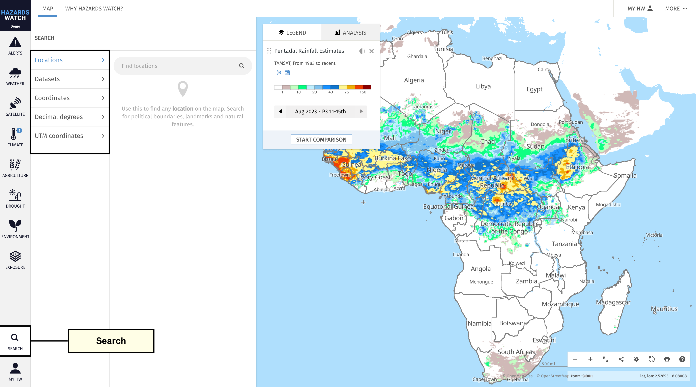
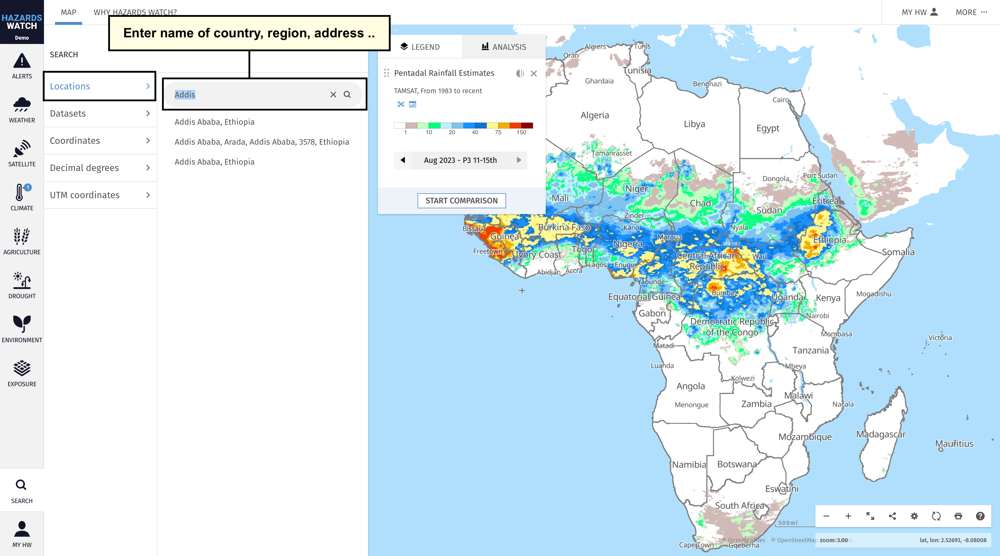
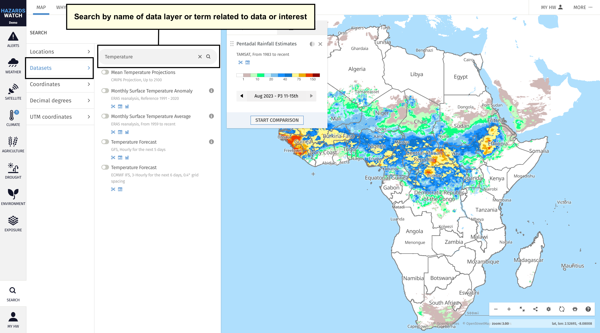
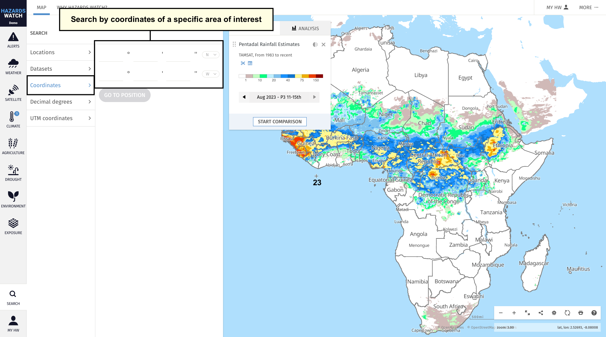
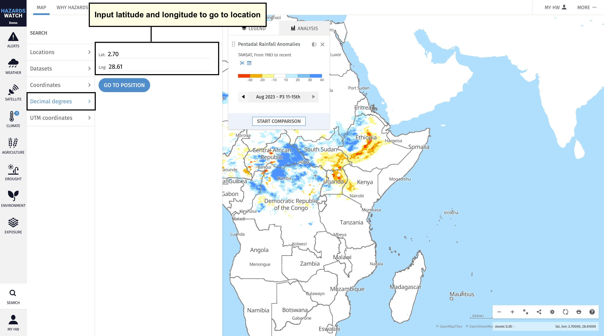
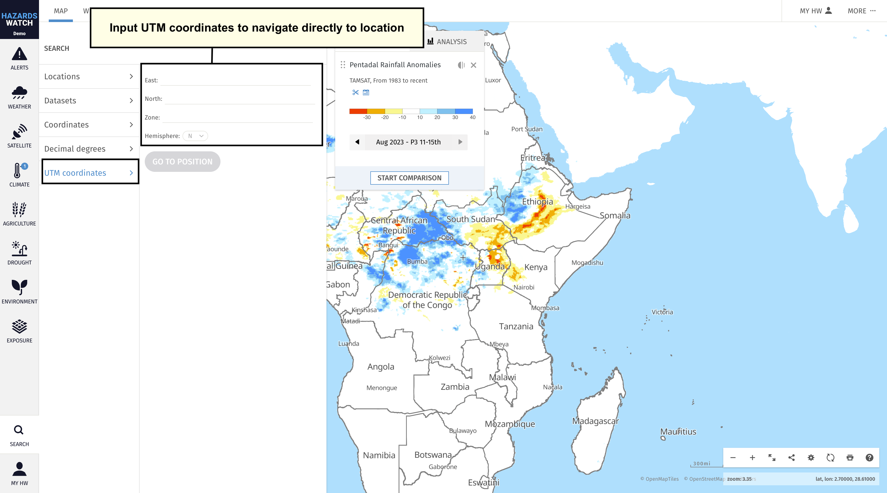

# Search for an area on the map

The search tool on HW offers an easy way to quickly find an area, location or data layer on the map.

- To get started, click the “Search” category on the menu. From here, you will have several options for searching for an area of interest: Locations, datasets, coordinates, decimal degrees and UTM coordinates.

- The “Locations” search is selected by default. Enter the name of a country, region, address, landmark or natural feature in the search bar. Once entered, the window will automatically populate with any relevant areas. If you do not see a specific area or location in search results, try checking your spelling, searching for a nearby location

- Select the “Datasets” search to enter the name of a data layer or a term related to data that you are interested in. Once entered, the window will automatically populate with any relevant data layers.

- Select the “Coordinates” search to enter coordinates for a specific area of interest. After entering the coordinate information, click “Go to position” and the map will automatically adjust to that location.

- Select the “Decimal degrees” search to search by latitude and longitude. Enter the latitude and longitude information then click “Go to position” and the map will automatically adjust to that location. HW also provides the latitude and longitude values for all areas on the map based on the crosshair position. This information can be found at the bottom-right corner of the map.

- Select the “UTM coordinates” search to search for coordinates based on the Universal Transverse Mercator (UTM) coordinate system. Enter the UTM coordinate data then click “Go to position” and the map will automatically adjust to that location.

