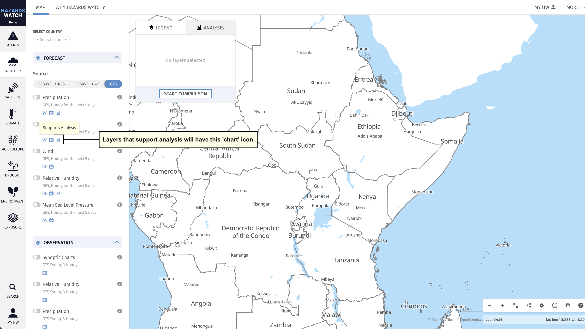
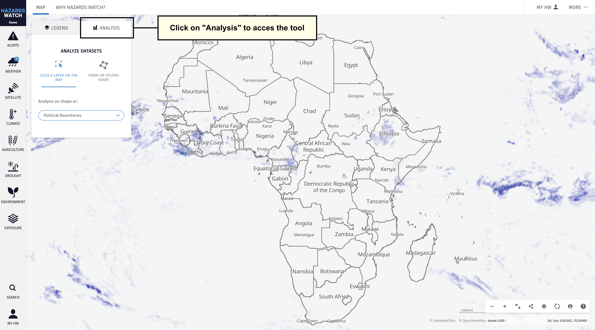
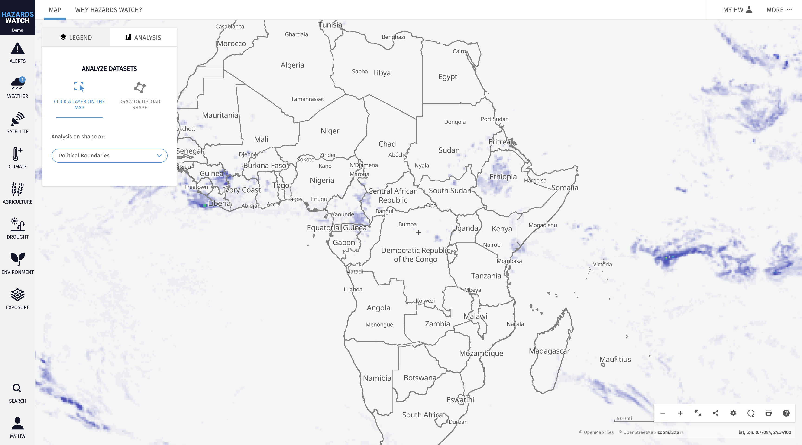
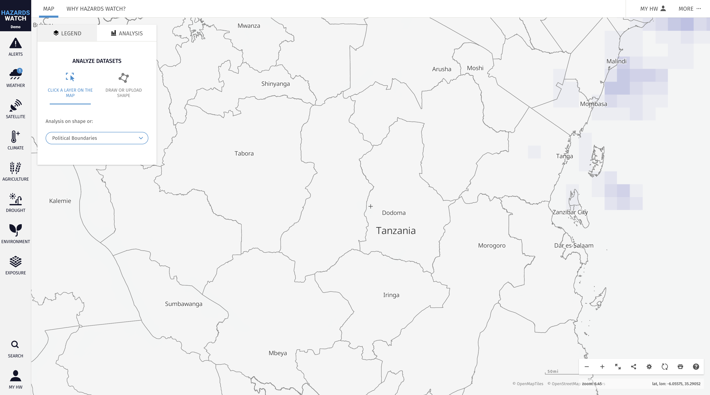
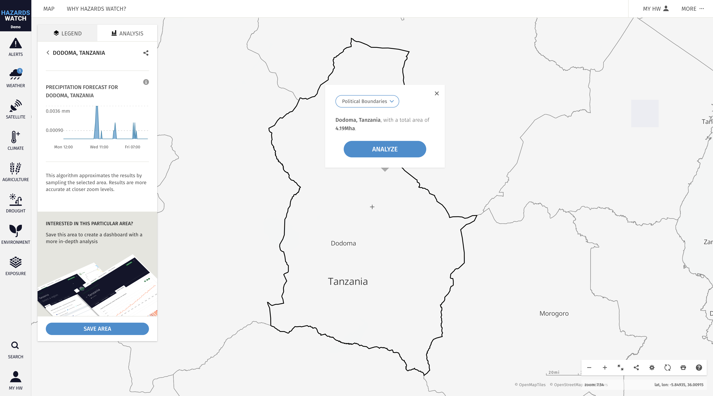
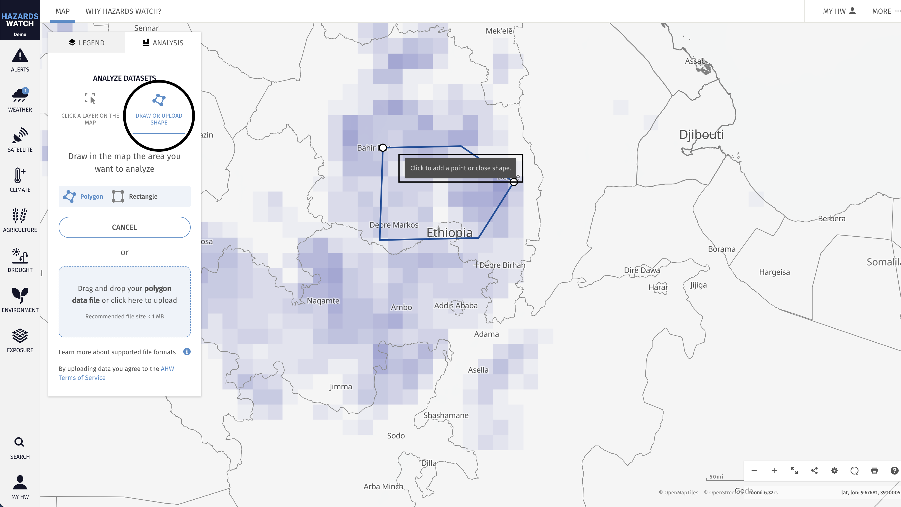
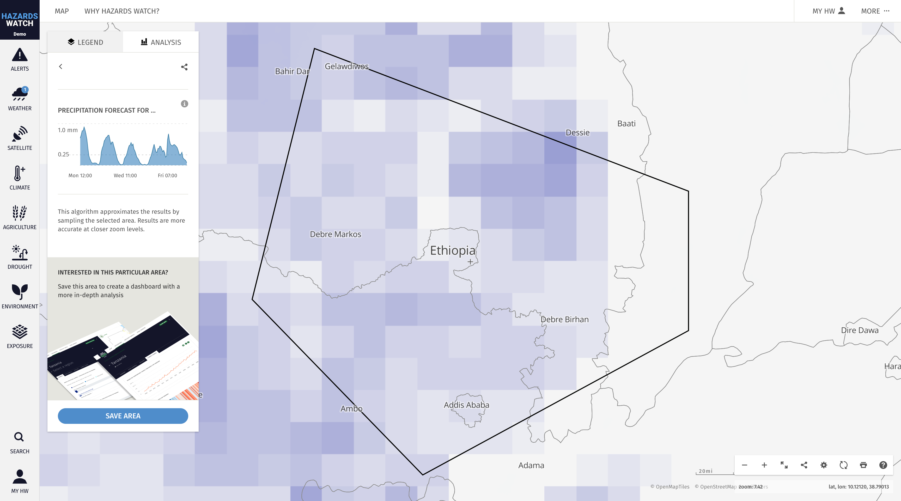

# Analyze data within an area on the map

The analysis tool is a quick way to analyze data within an area on the map. You can analyze countries, subnational areas, shapes from contextual layers or custom areas. The analysis tool is also useful for generating visualizations and data charts that can be used in reports and articles.

Below you will find information on how to run analyze a country or subnational region and how to analyze a custom area on the map.

## Data layers compatible with the analysis tool
Not all layers can be analysed. To view if a layer supports analysis or not, you can check for the "chart" icon as show in the screenshot below

## Analyze a country or subnational region

1. To run an analysis at the country or subnational level on the map, first click on the “Analysis” tab located on the legend/analysis panel.

2. From there, you are presented with two options: “Click a layer on the map” and “Draw or upload shape.” Select the “Click a layer on the map” option and then click on the map layer you wish to analyze. Zooming out will allow you to select an entire country, while zooming in will allow you to select subnational boundaries. You can also use the search tool on the bottom left to find the country, province, state or district that you’d like to analyze. Learn more about searching for an area here.

3. Once you click on a layer, the analysis will automatically run and produce data charts within the legend/analysis panel.  To include more data charts, you will need to activate additional data layers that support analysis.

## Analyze a custom area

1. If you have a specific area of interest you would like to monitor and analyze that is not part of an existing data layer on HW, you can use the analysis tool to draw a shape or upload a shapefile. Get started by navigating to the “Analysis” tab on the legend/analysis panel and clicking “Draw or Upload Shape.”

2. To draw a shape, click “Start Drawing” and define your area of interest by clicking on the map to place points. You will need to close the shape by returning to the first point you placed and clicking on it.

3. Once your shape is complete, the analysis will automatically run and produce data charts in the analysis tab.

4. You can also upload your own shapefile. To upload a shapefile, select a file from your computer and drag and drop into the analysis box. You will only be able to upload and analyze one shapefile at a time; however, there is no limit to the total number of shapefiles you can upload to the map. The recommended maximum file size is 1MB – anything larger than that may not work properly.

5. The shape will appear on the map and the analysis will automatically run and produce data charts in the analysis tab.