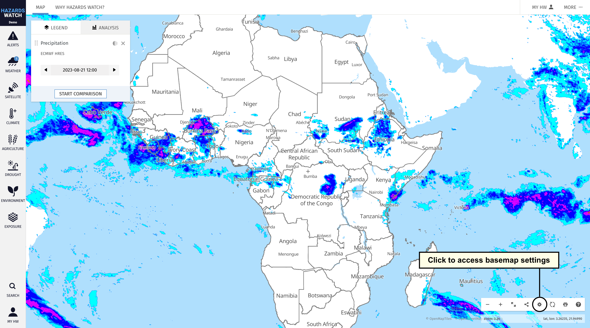
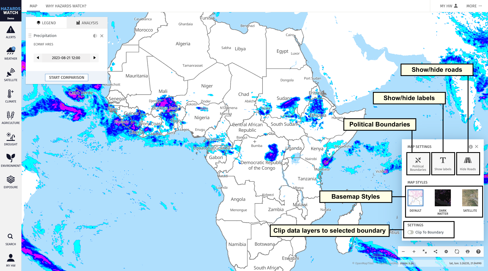
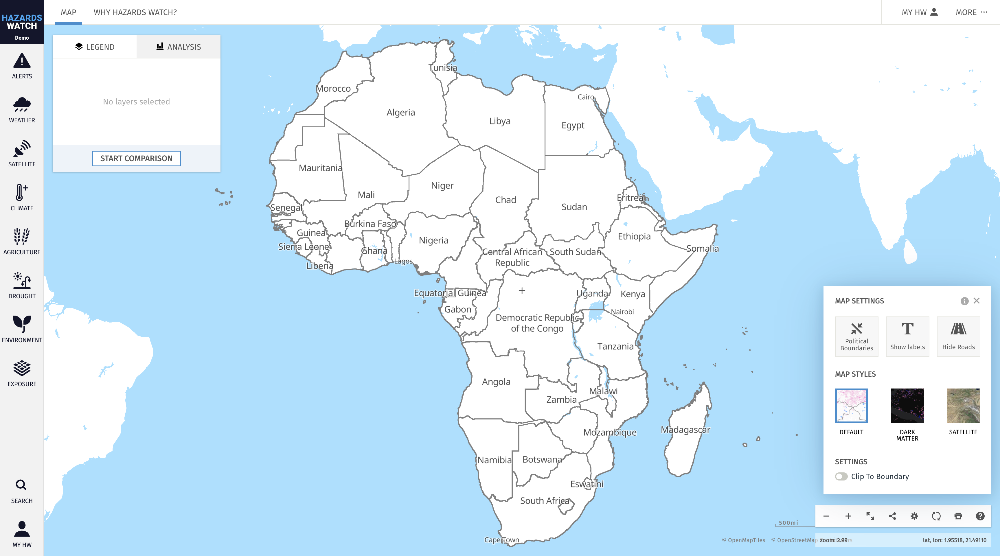
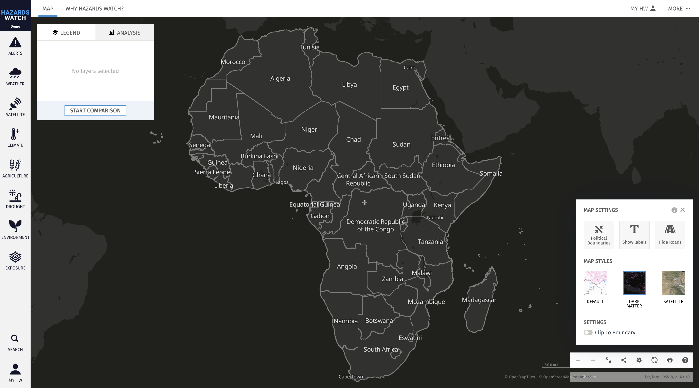

# Select and customize the basemap

One of HW's most important tools for monitoring and communicating an area is the customizable basemap. Basemaps in HW are defined by a set of customizable settings and styles, as well as optional satellite imagery.

1. Settings and styles can be accessed by clicking the gear icon at the bottom right corner of the map.

2. There are several customizable basemap settings:

    - **Political boundaries:** You can adjust the boundary view of the map by clicking the boundaries icon. By default, the map is populated with defined political boundaries for countries and regions. You can change the map view to show no boundaries.

    - **Show/hide labels:** The show labels feature allows you to add or remove text labels to the map. By default, “Show labels” is selected when first accessing the map.

    - **Show/hide roads:** The show roads feature allows you to show or remove roads on the map when zoomed in. By default, “Hide Roads” is selected when first accessing the map.

3. There are two customizable basemap styles:

    - **Default:** The “Default” Map is from OpenStreetMap data. This basemap is the default when first accessing the map.

    - **Dark Matter:** The “Dark Matter” basemap is also from OpenStreetMap data and provides a clean interface for viewing data. It can simplify the map view, helping to identity important areas of interest on the map.

    - **Satellite**: This option provides high-resolution satellite imagery sourced from Google. It is helpful for providing contextual information about an area, as it includes geographic names and markers sourced from Google. Because the imagery is a mosaic of satellite images from different time periods, it is not useful for investigating alerts in near real-time but can be valuable for helping to orient yourself or others on the map.

