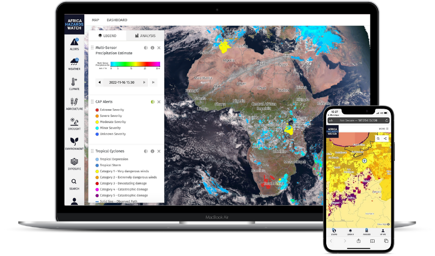
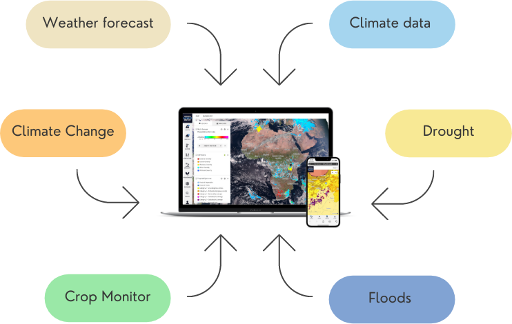

:hidetoc: 1

Welcome to the Hazards Watch user guide
========================================

|

Overview
----------

The Hazards Watch is intended to aggregate data and products from different sources including Global Producing Centres, Regional Specialized Meteorological Centres (RSMCs) and Regional Climate Centres (RCCs), and products from meteorological satellites. Availing the data in easily and accessible format will help in closing the gaps between the advanced National Meteorological and Hydrological Service (NMHSs) and those with more limited technical capacities.

Specifically, the platform aims to contribute to the following, among others:

- Improve data utilization and incentivise data sharing for better forecasting

- Support access and comparison of forecasts by different centres

- Provision of geo-targeted multi-sectoral impact-based services

- Strengthen user interaction with products and analysis of historical trends

- Support the digital transformation of the NMHSs, RSMCs, and RCCs

|

|

The map on Hazards Watch allows to explore spatial datasets from these different sources in an organized manner.

Step-by-step guides
--------------------

Explore step-by-step instructions to learn how to use the map for weather and climate monitoring

.. toctree::
   :maxdepth: 2
   :titlesonly:

   guides/01-use-the-map
   guides/02-adjust-map-data-settings
   guides/03-search-area-map
   guides/04-analyze-data-map
   guides/05-select-customize-basemap
   guides/06-save-area